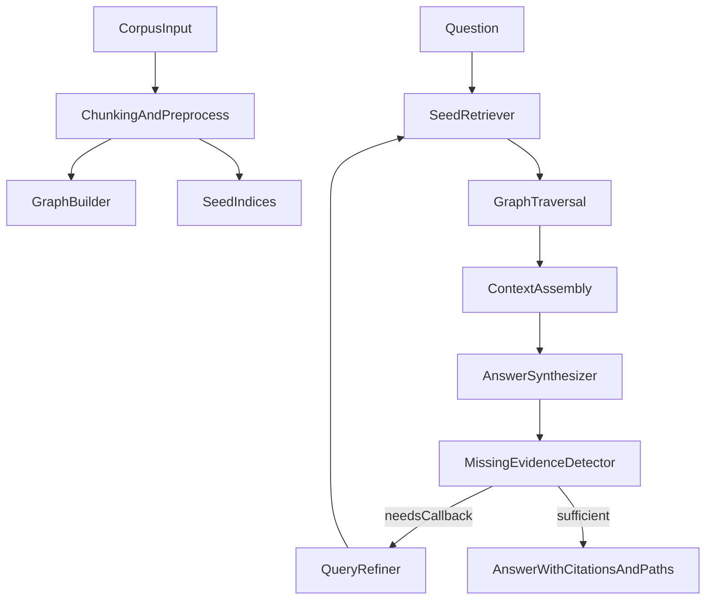

# TraceGraph

TraceGraph is a graph-based retrieval and revisitable-agent system for multi-hop long-context reasoning.  
Instead of relying only on flat top-k retrieval, it builds a sparse chunk graph and traverses evidence paths to answer questions with citations and path explanations.

## Motivation

Flat top-k retrieval often misses bridge evidence in multi-hop questions. TraceGraph addresses this by:
- retrieving seed chunks with BM25/entity/dense signals,
- traversing graph links (NEXT, SHARED_ENTITY, LEXICAL_SIM, optional RELATION),
- assembling compact diverse evidence,
- optionally running callbacks to refine retrieval when evidence is incomplete.

## TraceGraph Pipeline

1. Load corpus/documents.
2. Chunk into nodes with metadata.
3. Extract entities and keywords.
4. Build sparse graph and indices.
5. Run seed retrieval.
6. Traverse graph under budget.
7. Assemble context.
8. Draft/finalize answer with citations.
9. Optionally callback: detect missing evidence -> refine query -> re-retrieve.



## Repository Structure

- `src/tracegraph/`: core package modules.
- `configs/`: default, retrieval, evaluation, and ablation configs.
- `scripts/`: thin command wrappers for demos and grading workflows.
- `tests/`: deterministic offline pytest suite.
- `data/`: raw, processed, demo, cache, and outputs.
- `examples/`: sample questions and output format.

## Installation

Python 3.11+ is required.

```bash
python -m venv .venv
source .venv/bin/activate
pip install -e .
```

Optional dependencies:

```bash
pip install -e ".[dev,embeddings,pretty]"
```

Install spaCy model:

```bash
./scripts/download_spacy_model.sh
```

Optional OpenAI-compatible vars (not required for default offline mode):

```bash
cp .env.example .env
```

## Quickstart

```bash
python -m tracegraph.cli prepare-demo --output-dir data/demo --force
python -m tracegraph.cli build-graph --config configs/default.yaml --input-dir data/demo
python -m tracegraph.cli retrieve --question "What decision did we make about data retention, and which compliance clause justified it?"
python -m tracegraph.cli answer --question "What decision did we make about data retention, and which compliance clause justified it?" --llm-mode mock
python -m tracegraph.cli evaluate --config configs/evaluation/demo.yaml
python -m tracegraph.cli ablations --config configs/evaluation/demo.yaml
python -m tracegraph.cli report --results-dir data/outputs/runs/latest
```

Installed script entrypoint:

```bash
tracegraph --help
```

## Configuration

Key config sections:
- `chunking`
- `retrieval`
- `graph`
- `traversal`
- `callbacks`
- `llm`
- `evaluation`
- `persistence`

Variant configs:
- `configs/retrieval/bm25_only.yaml`
- `configs/retrieval/bm25_graph.yaml`
- `configs/retrieval/bm25_graph_callbacks.yaml`
- `configs/retrieval/embedding_graph.yaml`
- `configs/retrieval/final_demo.yaml` (submission demo profile)
- `configs/evaluation/final_eval_small.yaml` (submission benchmark matrix profile)

## Evaluation and Ablations

Implemented metrics:
- Exact Match (EM)
- Token-level F1
- Evidence coverage proxies
- Latency and callback counts

Ablations include:
- edge type variants,
- traversal budget variants,
- callbacks on/off,
- seed method comparisons.

Current compact benchmark recommendation:
- **Primary system for grading/presentation:** `bm25_graph`
- Rationale: same EM/F1 as callbacks on the demo slice, better evidence coverage than flat retrieval, and lower latency than callbacks.
- Use callbacks as an optional analysis mode when demonstrating iterative behavior.

## Persistence and Outputs

Each run writes artifacts under `data/outputs/runs/<timestamp_dataset_variant>/`:
- `artifacts/` (documents, chunks, graph, indices, state)
- `retrieval/` (bundle, context, path explanation)
- `agent/` (final answer and callback traces)
- `evaluation/` (predictions, metrics, summaries)
- `ablations/` (comparison tables + summary)
- `reports/` (markdown report + case studies)

## Example

Question:  
`What decision did we make about data retention, and which compliance clause justified it?`

Answer (example):  
`Logs were retained for 24 months, justified by clause C-12.`

Citations and retrieval-path explanations are first-class outputs.

## Limitations

- Relation edges are lightweight heuristic links.
- Supporting-fact alignment is approximate at chunk granularity.
- Quality depends on chunking and retrieval config choices.
- Offline default uses deterministic mock/heuristic generation rather than external LLM calls.

## Future Work

- Better relation extraction and sentence-level evidence alignment.
- Learned traversal/reranking.
- Improved callback policies.
- Additional benchmark integrations.

## Reproducibility

- Deterministic seeds by default.
- Resolved config persisted per run.
- Stable hashing for corpus/config compatibility checks.
- Saved outputs and diagnostics for rerun and grading.

Final submission run flow:

```bash
python -m tracegraph.cli prepare-demo --output-dir data/demo --force
python -m tracegraph.cli build-graph --config configs/default.yaml --input-dir data/demo
python -m tracegraph.cli evaluate --config configs/evaluation/final_eval_small.yaml --variant all
python -m tracegraph.cli ablations --config configs/evaluation/demo.yaml --limit 8
python -m tracegraph.cli report --results-dir data/outputs/runs/<your_matrix_run_dir>
```
